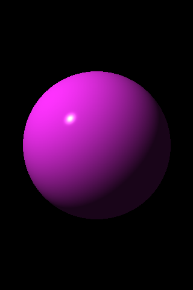

# Ray Tracer

This project is based on the book `The Ray Tracer Challenge` by `Jamis Buck`.

I decided to write it in C, hoping that I could later use it in embedded devices. I now regret. The matrix implementation is a complete piece of garbage (another way to call its inefficiency).

## Compile & Run
Currently this project does not utilize CMake. To compile run the following in the main directory:

```bash
gcc main.c src/*.c -Iinclude/
```

Then run the executable output. The rendered image is stored in the file `bitmap1.bmp` in the same directory as the executable.

## Current State


*Chapter 6: Light and Shading*